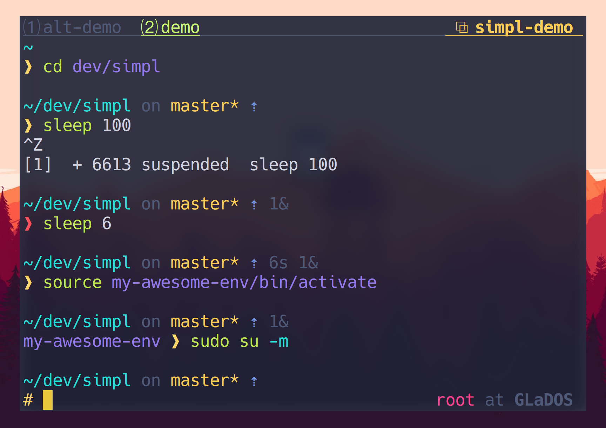

# Simpl

> Pretty, minimal, customizable and fast ZSH prompt based on
> @sindresorhus's [Pure](https://github.com/sindresorhus/pure)




## Screencast

<a href="https://asciinema.org/a/7td6jwaefjcnq23sta884t7wr" target="_blank"></a>


## Overview

Most prompts are cluttered, ugly and slow. I wanted something minimalist and
visually pleasing that stayed out of my way.

### Why?

- Comes with the perfect prompt character.
  Author went through the whole Unicode range to find it.
- Shows `git` branch and whether it's dirty (with a `*`).
- Indicates when you have unpushed/unpulled `git` commits with up/down arrows. *(Check is done asynchronously!)*
- Prompt character turns red if the last command didn't exit with `0`.
- Command execution time will be displayed if it exceeds the set threshold.
- Username and host only displayed when in an SSH session.
- Allow to use the right prompt to show the username and host
- Shows the current path in the title and the [current folder & command](screenshot-title-cmd.png) when a process is running.
- Makes an excellent starting point for your own custom prompt.
- Very customizable

### Description

My prompt consist of 3 parts, the main left-sided prompt just with a prompt
character so I have room for long commands, a pre-left-sided prompt to display
the main context (e.g. pwd and git info), and a right-sided prompt for
additional context that dissapears when text goes over it or line is accepted.

This structure makes it easy to read for me as I can identify easily the
executed commands and working directories through the scrollback buffer due to
its fixed position in the line. Since the right-sided prompt is splited in 2
lines it works well on small windows. This is perfect to me as I always end up
working with multiple tmux panes.

To keep it simple I just support the features I use on a daily basis, so this
prompt won't be cluttered with fancy battery indicators.

Prompt with right prompt enabled:

```
~/dev/simpl on ⇡ master* ↻4 42s
virtualenv ❱                                                 eduarbo at GlaDoS
```

Prompt with right prompt disabled:

```
eduarbo at GlaDoS in ~/dev/simpl on ⇡ master* ↻4 42s
virtualenv ❱
```

#### Left prompt:

- `❱` is shown if you are a normal user. When root, a classic # will be shown instead
- `❱` will be `$SIMPL[PROMPT_SYMBOL_COLOR]` if the last command exited successfully,
otherwise will be `$SIMPL_PROMPT_SYMBOL_FAIL_COLOR` (defaults to red)
- Displays python's virtualenv name before `❱` if activated

#### Pre left prompt:

- A short `pwd` version is shown
- Shows username and host when `SIMPL[ENABLE_RPROMPT]=0`
- Shows git branch and whether it's dirty (with a *)
- Indicates when you have unpushed/unpulled git commits with up/down arrows.
  (Check is done asynchronously!)
- Command execution time will be displayed if it exceeds the set threshold
  (default 5 seconds)
- Show number of background jobs (if any)

#### Right prompt:

- Shows username and host when `SIMPL[ENABLE_RPROMPT]=1`


## Customization

Simpl supports customization by setting the following variables before sourcing
the prompt, but before that, declare the **SIMPL** namespace `typeset -A SIMPL`.

| Option                                 | Description                                                                             | Default value  |
| :---                                   | :---                                                                                    | :---           |
| **`SIMPL[ALWAYS_SHOW_USER]`**          | Always show username even if not in an SSH session                                      | `0`            |
| **`SIMPL[ALWAYS_SHOW_USER_AND_HOST]`** | Always show username and host even if not in an SSH session                             | `0`            |
| **`SIMPL[CMD_MAX_EXEC_TIME]`**         | The max execution time of a process before its run time is shown when it exits          | `1` second     |
| **`SIMPL[ENABLE_RPROMPT]`**            | Enable right prompt to display user and host there                                      | `0`            |
| **`SIMPL[GIT_DELAY_DIRTY_CHECK]`**     | Time in seconds to delay git dirty checking when `git status` takes > 5 seconds         | `1800` seconds |
| **`SIMPL[GIT_PULL]`**                  | Check whether the current Git remote has been updated                                   | `1`            |
| **`SIMPL[GIT_UNTRACKED_DIRTY]`**       | Include untracked files in dirtiness check. Mostly useful on large repos (like WebKit). | `1`            |
|                                        |                                                                                         |                |
| **`SIMPL[GIT_DIRTY_SYMBOL]`**          | Defines the symbol for dirty git branches                                               | `*`            |
| **`SIMPL[GIT_DOWN_ARROW]`**            | Defines the git down arrow symbol                                                       | `⇣`            |
| **`SIMPL[GIT_UP_ARROW]`**              | Defines the git up arrow symbol                                                         | `⇡`            |
| **`SIMPL[JOBS_SYMBOL]`**               | Defines the background jobs symbol                                                      | `↻`            |
| **`SIMPL[PROMPT_ROOT_SYMBOL]`**        | Defines the prompt symbol when logged in as root                                        | `#`            |
| **`SIMPL[PROMPT_SYMBOL]`**             | Defines the prompt symbol                                                               | `❱`            |
|                                        |                                                                                         |                |
| **`SIMPL[DIR_COLOR]`**                 | Defines color for the current working directory                                         | `%F{magenta}`  |
| **`SIMPL[EXEC_TIME_COLOR]`**           | Defines color for the max execution time of a process                                   | `%B%F{8}`      |
| **`SIMPL[GIT_ARROW_COLOR]`**           | Defines color for both git arrows symbol                                                | `%B%F{9}`      |
| **`SIMPL[GIT_BRANCH_COLOR]`**          | Defines color for the git branch symbol                                                 | `%F{14}`       |
| **`SIMPL[GIT_DIRTY_COLOR]`**           | Defines color for the git dirty symbol                                                  | `%F{9}`        |
| **`SIMPL[HOST_COLOR]`**                | Defines color for the host                                                              | `%F{10}`       |
| **`SIMPL[HOST_SYMBOL_COLOR]`**         | Defines color for the host symbol                                                       | `%B%F{10}`     |
| **`SIMPL[JOBS_COLOR]`**                | Defines color for the background jobs                                                   | `%B%F{8}`      |
| **`SIMPL[PREPOSITION_COLOR]`**         | Defines color for all the prepositions                                                  | `%F{8}`        |
| **`SIMPL[PROMPT_SYMBOL_COLOR`**        | Defines color for the prompt symbol                                                     | `%F{11}`       |
| **`SIMPL[PROMPT_SYMBOL_ERROR_COLOR]`** | Defines color for the prompt symbol when last command didn't exit with 0                | `%F{red}`      |
| **`SIMPL[PROMPT2_SYMBOL_COLOR]`**      | Defines color for the prompt2 symbol                                                    | `%F{8}`        |
| **`SIMPL[USER_COLOR]`**                | Defines color for the username                                                          | `%F{10}`       |
| **`SIMPL[USER_ROOT_COLOR]`**           | Defines color for the username when logged in as root                                   | `%B%F{red}`    |
| **`SIMPL[VENV_COLOR]`**                | Defines color for the python virtualenv                                                 | `%F{yellow}`   |

## Example

```sh
# .zshrc
autoload -U promptinit; promptinit

# Declare the namespace for the options
typeset -A SIMPL

# optionally define some options
SIMPL[CMD_MAX_EXEC_TIME]=10
SIMPL[GIT_DIRTY_SYMBOL]="•"
SIMPL[JOBS_COLOR]="%B%F{red}"

prompt simpl
```


## Install

### Manually

1. Either…
  - Clone this repo
  - add it as a submodule, or
  - just download [`simpl.zsh`](simpl.zsh) and [`async.zsh`](https://github.com/mafredri/zsh-async/blob/master/async.zsh)

2. Symlink `simpl.zsh` to somewhere in [`$fpath`](http://www.refining-linux.org/archives/46/ZSH-Gem-12-Autoloading-functions/) with the name `prompt_simpl_setup`.

3. Symlink `async.zsh` in `$fpath` with the name `async`.

### [oh-my-zsh](https://github.com/robbyrussell/oh-my-zsh)

1. Symlink (or copy) `simpl.zsh` to `~/.oh-my-zsh/custom/simpl.zsh-theme`.
2. Symlink (or copy) [`async.zsh`](https://github.com/mafredri/zsh-async/blob/master/async.zsh) to `~/.oh-my-zsh/custom/async.zsh`.
3. Set `ZSH_THEME="simpl"` in your `.zshrc` file.
4. Do not enable the following (incompatible) plugins: `vi-mode`, `virtualenv`.

**NOTE:** `oh-my-zsh` overrides the prompt so Simpl must be activated *after* `source $ZSH/oh-my-zsh.sh`.

### [antigen](https://github.com/zsh-users/antigen)

Update your `.zshrc` file with the following two lines (order matters). Do not use the `antigen theme` function.

```sh
antigen bundle mafredri/zsh-async
antigen bundle eduarbo/simpl
```

### [antibody](https://github.com/getantibody/antibody)

Update your `.zshrc` file with the following two lines (order matters):

```sh
antibody bundle mafredri/zsh-async
antibody bundle eduarbo/simpl
```

### [zplug](https://github.com/zplug/zplug)

Update your `.zshrc` file with the following two lines:

```sh
zplug mafredri/zsh-async, from:github
zplug eduarbo/simpl, use:simpl.zsh, from:github, as:theme
```

### [zplugin](https://github.com/zdharma/zplugin)

Update your `.zshrc` file with the following two lines (order matters):

```sh
zplugin light mafredri/zsh-async
zplugin light eduarbo/simpl
```


## Tips

In the screenshot you see Simpl running in [iTerm2](https://www.iterm2.com/) with a custom theme and [Hack](https://sourcefoundry.org/hack/) font.

To have commands colorized as seen in the screenshot, install [zsh-syntax-highlighting](https://github.com/zsh-users/zsh-syntax-highlighting).


## License

Simpl MIT © [Eduardo Ruiz](http://eduarbo.com) <br/>
Pure MIT © [Sindre Sorhus](https://sindresorhus.com)
